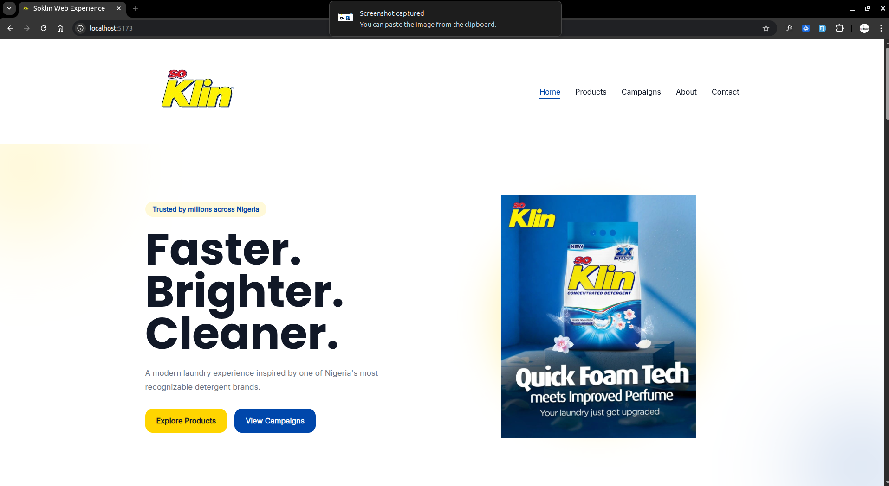
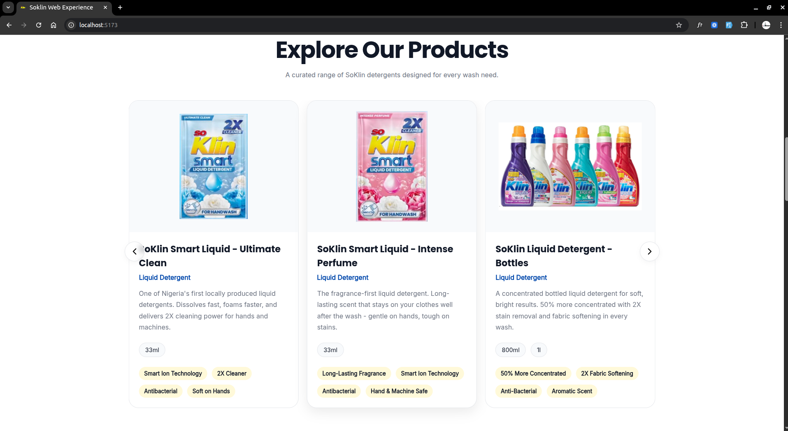
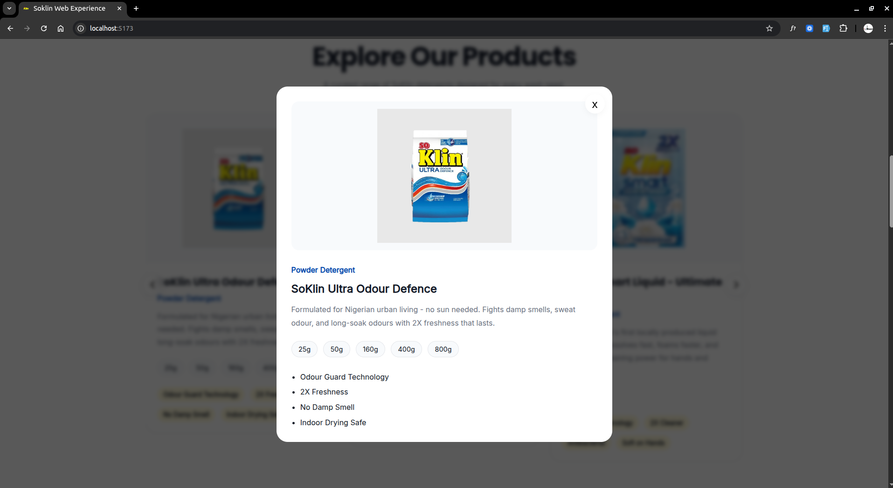
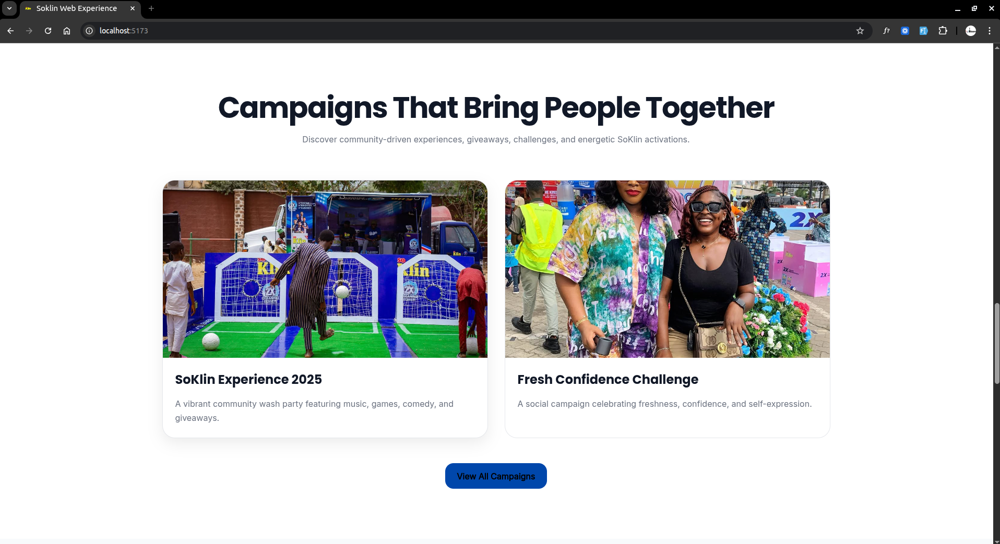
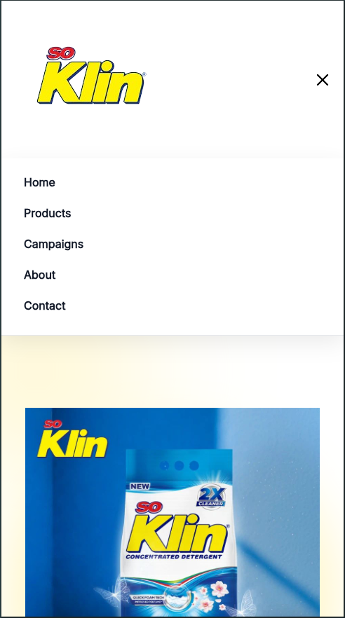

# SoKlin Concept Experience

A modern, conceptual redesign of the SoKlin digital experience built with Vue 3, TypeScript, and a focus on clean UI/UX systems, product discovery, and interactive storytelling.

This project is a frontend portfolio build exploring how a household brand like SoKlin could be experienced in a more modern, digital-first environment.

---

## Live Demo

(Add your deployment link here once ready)

---

## Tech Stack

- Vue 3
- TypeScript
- Vue Router
- Pinia
- CSS3 (custom design system)
- Swiper.js (carousel interactions)
- VueUse Motion (animations)

---

## Features

### Product Experience

- Product carousel with navigation controls
- Product detail modal system
- Category-based filtering via URL queries
- Search functionality for products
- Responsive product grid layout

### Campaign System

- Campaign showcase section
- Interactive campaign cards
- Campaign modal system
- Story-driven layout for brand activations

### UI / UX System

- Fully responsive design (mobile-first)
- Global animation system (scroll reveal + transitions)
- Micro-interactions and hover states
- Consistent design tokens and spacing system

### Navigation & Layout

- Sticky responsive navbar
- Mobile navigation menu
- Reusable layout system
- Section-based homepage architecture

---

## Project Purpose

This is a conceptual frontend project built for:

- Portfolio demonstration
- UI/UX experimentation
- Component architecture practice
- Animation and interaction design exploration

It is not an official SoKlin product or affiliated with the brand.

---

## What I Learned

- Structuring scalable Vue component systems
- Building reusable UI patterns
- Managing state with Pinia
- Designing interactive user flows (modal systems, filters, navigation)
- Creating smooth UI transitions and motion systems
- Improving accessibility and responsiveness in real-world layouts

---

## Screenshots







---

## Installation

```bash
npm install
npm run dev
```

---

## Author

Built by **Oluwaseun Fatoye**

Frontend Developer focused on Vue.js, React, and modern UI systems.

- GitHub: (add your GitHub link here)
- Portfolio: (add your portfolio link here)
- Email: (optional)

---

## License

This project is for educational and portfolio purposes only.

It is a conceptual redesign and is not affiliated with SoKlin or its parent company.

All trademarks, logos, and brand references belong to their respective owners.
